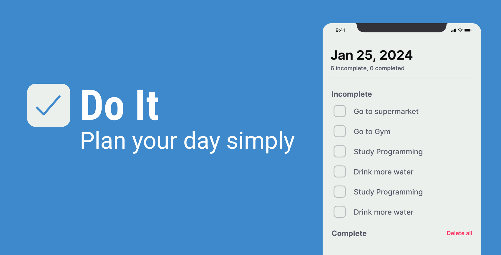

 
 <br />
  <br />

<p>
  Have you ever wanted an uncomplicated way to keep your daily tasks under control? Introducing Do It, an intuitive and efficient designed to simplify your everyday life.
</p>

 <h3>📚 Technologies</h3>

  
  
  
  
  

  ---

   ### Installation Guide (Linux and Windows)

  #### Prerequisites
  
  - Before you begin, ensure you have the following prerequisites installed:
  - Node.js and npm: You can download and install them from the official Node.js website: Node.js
  - Expo CLI: Install Expo CLI globally using npm:
  ```bash
  npm install -g expo-cli
  ```

  1. Clone the repository:
  Open your terminal (Command Prompt for Windows) and execute the following command to clone the Do It repository:
  ```bash
  git clone git@github.com:CesarCanoff/doit-mobile-app.git
  ```

  2. Navigate to the app directory:
  Change to the Do It directory that you just cloned:
  ```bash
  git clone git@github.com:CesarCanoff/doit-mobile-app.git
  ```

  3. Install dependencies:
  Use npm to install all the app's dependencies. This may take some time depending on the project's size:
  ```bash
  npm install
  ```
  4. Start the app with Expo:
  After the dependencies are successfully installed, you can start the Do It using Expo Go. Run the following command:
  ```bash
  npx expo start
  ```
